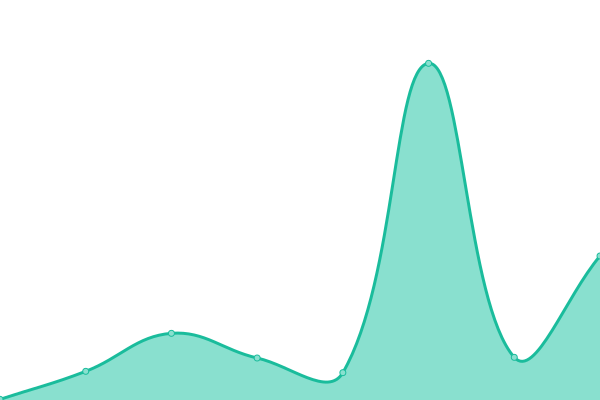

# [📈 Live Status](https://Inktomi93.github.io/inktomitech_uptime): <!--live status--> **🟧 Partial outage**

This repository contains the open-source uptime monitor and status page for [Inktomi93](https://Inktomi93.github.io/inktomitech_uptime), powered by [Upptime](https://github.com/upptime/upptime).

With [Upptime](https://upptime.js.org), you can get your own unlimited and free uptime monitor and status page, powered entirely by a GitHub repository. We use [Issues](https://github.com/Inktomi93/inktomitech_uptime/issues) as incident reports, [Actions](https://github.com/Inktomi93/inktomitech_uptime/actions) as uptime monitors, and [Pages](https://Inktomi93.github.io/inktomitech_uptime) for the status page.

<!--start: status pages-->
<!-- This summary is generated by Upptime (https://github.com/upptime/upptime) -->
<!-- Do not edit this manually, your changes will be overwritten -->
<!-- prettier-ignore -->
| URL | Status | History | Response Time | Uptime |
| --- | ------ | ------- | ------------- | ------ |
|  [Google](https://www.google.com) | 🟩 Up | [google.yml](https://github.com/Inktomi93/inktomitech_uptime/commits/HEAD/history/google.yml) | 

 76ms
     
 | 

<a href="https://Inktomi93.github.io/inktomitech_uptime/history/google">100.00%</a>
    

|  [Wikipedia](https://en.wikipedia.org) | 🟩 Up | [wikipedia.yml](https://github.com/Inktomi93/inktomitech_uptime/commits/HEAD/history/wikipedia.yml) | 

 176ms
     
 | 

<a href="https://Inktomi93.github.io/inktomitech_uptime/history/wikipedia">100.00%</a>
    

|  [Hacker News](https://news.ycombinator.com) | 🟩 Up | [hacker-news.yml](https://github.com/Inktomi93/inktomitech_uptime/commits/HEAD/history/hacker-news.yml) | 

 417ms
     
 | 

<a href="https://Inktomi93.github.io/inktomitech_uptime/history/hacker-news">100.00%</a>
    

|  [Test Broken Site](https://thissitedoesnotexist.koj.co) | 🟥 Down | [test-broken-site.yml](https://github.com/Inktomi93/inktomitech_uptime/commits/HEAD/history/test-broken-site.yml) | 

 0ms
     
 | 

<a href="https://Inktomi93.github.io/inktomitech_uptime/history/test-broken-site">100.00%</a>
    

|  [IPv6 test](forwardemail.net) | 🟥 Down | [i-pv6-test.yml](https://github.com/Inktomi93/inktomitech_uptime/commits/HEAD/history/i-pv6-test.yml) | 

 0ms
     
 | 

<a href="https://Inktomi93.github.io/inktomitech_uptime/history/i-pv6-test">100.00%</a>
    

|  [Authentik Domain](https://authentik.inktomi.tech) | 🟩 Up | [authentik-domain.yml](https://github.com/Inktomi93/inktomitech_uptime/commits/HEAD/history/authentik-domain.yml) | 

 535ms
     
 | 

<a href="https://Inktomi93.github.io/inktomitech_uptime/history/authentik-domain">100.00%</a>
    

|  [OpenWebUI](https://openwebui.inktomi.tech) | 🟩 Up | [open-web-ui.yml](https://github.com/Inktomi93/inktomitech_uptime/commits/HEAD/history/open-web-ui.yml) | 

 294ms
     
 | 

<a href="https://Inktomi93.github.io/inktomitech_uptime/history/open-web-ui">100.00%</a>
    

|  [Pi-hole](https://pihole.inktomi.tech) | 🟩 Up | [pi-hole.yml](https://github.com/Inktomi93/inktomitech_uptime/commits/HEAD/history/pi-hole.yml) | 

 632ms
     
 | 

<a href="https://Inktomi93.github.io/inktomitech_uptime/history/pi-hole">100.00%</a>
    

|  [SillyTavern](https://sillytavern.inktomi.tech) | 🟩 Up | [silly-tavern.yml](https://github.com/Inktomi93/inktomitech_uptime/commits/HEAD/history/silly-tavern.yml) | 

 617ms
     
 | 

<a href="https://Inktomi93.github.io/inktomitech_uptime/history/silly-tavern">100.00%</a>
    

|  [StirlingPDF](https://stirlingpdf.inktomi.tech) | 🟩 Up | [stirling-pdf.yml](https://github.com/Inktomi93/inktomitech_uptime/commits/HEAD/history/stirling-pdf.yml) | 

 1080ms
     
 | 

<a href="https://Inktomi93.github.io/inktomitech_uptime/history/stirling-pdf">100.00%</a>
    

|  [TabbyAPI](https://tabbyapi.inktomi.tech) | 🟥 Down | [tabby-api.yml](https://github.com/Inktomi93/inktomitech_uptime/commits/HEAD/history/tabby-api.yml) | 

 296ms
     
 | 

<a href="https://Inktomi93.github.io/inktomitech_uptime/history/tabby-api">0.95%</a>
    

|  [vLLM](https://vllm.inktomi.tech) | 🟩 Up | [v-llm.yml](https://github.com/Inktomi93/inktomitech_uptime/commits/HEAD/history/v-llm.yml) | 

 2166ms
     
 | 

<a href="https://Inktomi93.github.io/inktomitech_uptime/history/v-llm">100.00%</a>
    

|  [ComfyUI](https://comfyui.inktomi.tech) | 🟩 Up | [comfy-ui.yml](https://github.com/Inktomi93/inktomitech_uptime/commits/HEAD/history/comfy-ui.yml) | 

 650ms
     
 | 

<a href="https://Inktomi93.github.io/inktomitech_uptime/history/comfy-ui">100.00%</a>
    

|  [Portainer](https://portainer.inktomi.tech) | 🟩 Up | [portainer.yml](https://github.com/Inktomi93/inktomitech_uptime/commits/HEAD/history/portainer.yml) | 

 389ms
     
 | 

<a href="https://Inktomi93.github.io/inktomitech_uptime/history/portainer">100.00%</a>
    

<!--end: status pages-->

[**Visit our status website →**](https://Inktomi93.github.io/inktomitech_uptime)

## 📄 License

- Powered by: [Upptime](https://github.com/upptime/upptime)
- Code: [MIT](./LICENSE) © [Anand Chowdhary](https://anandchowdhary.com), supported by [Pabio](https://pabio.com)
- Data in the `./history` directory: [Open Database License](https://opendatacommons.org/licenses/odbl/1-0/)
